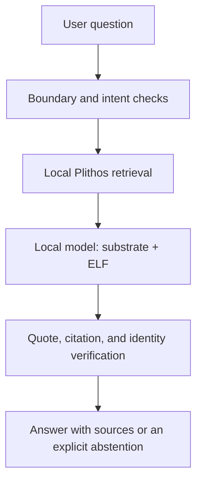

# Orthodox Intelligence

Orthodox Intelligence (OI) is a research and engineering project for a private,
offline-capable assistant whose behavior is deliberately shaped, whose governing
framework is inspectable, and whose substantive Orthodox answers are grounded in
the curated texts and provenance published by Plithos.

This repository begins with the research program. It now includes an executable
local source-navigator vertical slice, but it does **not** yet contain a trained
model, a production Ethical Learning Framework (ELF), a Plithos corpus export, or
an application ready for pastoral or public use.

## The design in one sentence

OI separates four things that must not be allowed to blur together:

1. a trained behavioral substrate;
2. a short, explicit, versioned Orthodox ELF;
3. an on-device Plithos evidence store; and
4. deterministic verification and product boundaries.



The model is not presented as a Christian, a member of the Church, clergy, a
spiritual father, or a substitute for sacramental and pastoral life. It is an
artificial system that reasons under a documented Orthodox-informed framework
and identifies the sources on which its answers rely.

## Repository map

- `docs/OI_RESEARCH_AND_TRAINING_SPECIFICATION_v0.1.md` - controlling v0.1
  research specification.
- `docs/ARCHITECTURE.md` - component boundaries and offline inference path.
- `docs/EVALUATION_PROTOCOL.md` - factorial experiment and release evaluation.
- `docs/DATA_AND_PROVENANCE.md` - corpus, rights, lineage, and contamination rules.
- `docs/ELF_REVIEW_PROTOCOL.md` - process for producing a production ELF.
- `docs/THREAT_MODEL.md` - anticipated failures and mitigations.
- `docs/ROADMAP.md` - staged work and exit criteria.
- `docs/DECISION_LOG.md` - decisions already made and their scope.
- `docs/OPEN_QUESTIONS.md` - matters intentionally not guessed in v0.1.
- `docs/MODEL_CARD_TEMPLATE.md` - evidence required for any model candidate.
- `schemas/` - machine-readable records for corpus, training, evaluation, and
  release manifests.
- `config/acceptance_criteria.v0.1.json` - provisional measurable gates.
- `tools/check_repository.py` and `tests/` - dependency-free repository checks.
- `prototype/` and `oi_prototype/` - visible offline demonstration and its local
  retrieval, policy, verifier, and HTTP components.
- `evaluation/` - development behavioral suite and runtime-neutral forced-choice
  scoring contract.

## Run the visible prototype

Python 3.10 or later is sufficient. No packages need to be installed.

```bash
python tools/serve_prototype.py
```

Then open `http://127.0.0.1:8765`. See `docs/PROTOTYPE.md` for its exact scope and
limitations.

## Validate the scaffold

Python 3.10 or later is sufficient; the validation path has no third-party
dependencies.

```bash
python tools/check_repository.py
python tools/run_evaluation.py --fail-on-any
python -m unittest discover -s tests -v
```

## Current status

Version `0.1` of the specification remains the design baseline derived from the
OEDMF/substrate distinction in Samuel Sheffield's dissertation and the subsequent
forced-choice experiment. The executable slice is retrieval-only and uses eight
project-policy excerpts, so it makes no claim about model quality or Orthodox
answer quality. Experimental ELFs are evidence, not production doctrine.
