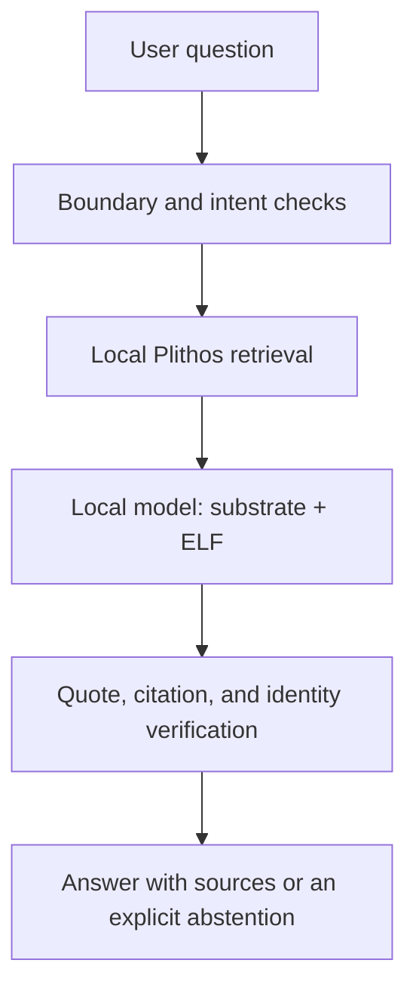

# Orthodox Intelligence

Orthodox Intelligence (OI) is a research and engineering project for a private,
offline-capable assistant whose behavior is deliberately shaped, whose governing
framework is inspectable, and whose substantive Orthodox answers are grounded in
the curated texts and provenance published by Plithos.

The repository now includes an executable local source-navigator vertical slice,
a verified English Plithos evidence package integration, reusable Plithos search,
and deterministic Old/New Calendar support. OLMo 2 7B Instruct is selected as
the reference stock substrate, but model weights are not bundled and the current
answer path remains retrieval-only until the generative evidence/verifier path is
wired and tested. The repository does **not** yet contain a production Ethical
Learning Framework (ELF) or an application ready for pastoral or public use.

## The design in one sentence

OI separates four things that must not be allowed to blur together:

1. a trained behavioral substrate;
2. a short, explicit, versioned Orthodox ELF;
3. an on-device Plithos evidence store; and
4. deterministic verification and product boundaries.



The model is not presented as a Christian, a member of the Church, clergy, a
spiritual father, or a substitute for sacramental and pastoral life. It is an
artificial system that reasons under a documented Orthodox-informed framework
and identifies the sources on which its answers rely.

## Repository map

- `docs/OI_RESEARCH_AND_TRAINING_SPECIFICATION_v0.1.md` - controlling v0.1
  research specification.
- `docs/ARCHITECTURE.md` - component boundaries and offline inference path.
- `docs/EVALUATION_PROTOCOL.md` - factorial experiment and release evaluation.
- `docs/DATA_AND_PROVENANCE.md` - corpus, rights, lineage, and contamination rules.
- `docs/ELF_REVIEW_PROTOCOL.md` - process for producing a production ELF.
- `docs/THREAT_MODEL.md` - anticipated failures and mitigations.
- `docs/ROADMAP.md` - staged work and exit criteria.
- `docs/DECISION_LOG.md` - decisions already made and their scope.
- `docs/OPEN_QUESTIONS.md` - matters intentionally not guessed in v0.1.
- `docs/MODEL_CARD_TEMPLATE.md` - evidence required for any model candidate.
- `config/model_olmo2_7b_instruct.v1.json` - selected OLMo 2 reference-substrate
  manifest; no weights are stored in this repository.
- `schemas/` - machine-readable records for corpus, training, evaluation, and
  release manifests.
- `config/acceptance_criteria.v0.1.json` - provisional measurable gates.
- `tools/check_repository.py` and `tests/` - dependency-free repository checks.
- `prototype/` and `oi_prototype/` - visible offline prototype and its local
  retrieval, calendar, policy, verifier, HTTP, and model-runtime adapter
  components.
- `evaluation/` - development behavioral suite and runtime-neutral forced-choice
  scoring contract.

## Run the visible prototype

Python 3.10 or later is sufficient. No packages need to be installed for the
retrieval-only prototype.

```bash
python tools/serve_prototype.py
```

Then open `http://127.0.0.1:8765`. See `docs/PROTOTYPE.md` for its exact scope and
limitations.

## Selected model substrate

The project owner selected `allenai/OLMo-2-1124-7B-Instruct` as the reference
stock substrate (S0). The model manifest records its Apache-2.0 license and the
project's no-remote-fallback requirement. `oi_prototype/model_runtime.py` provides
a development-only adapter to an explicitly configured loopback llama.cpp server.
This adapter does not download weights, does not contact a hosted inference API,
and does not select llama.cpp as the eventual production mobile runtime.

Before any experiment, the exact upstream model revision and the hash of the
local weight artifact must be frozen in the experiment record. Quantization and
the production mobile runtime remain subject to representative-device testing.

## Validate the scaffold

Python 3.10 or later is sufficient; the validation path has no third-party
dependencies.

```bash
python tools/check_repository.py
python tools/run_evaluation.py --fail-on-any
python -m unittest discover -s tests -v
```

## Current status

Version `0.1` of the specification remains the design baseline derived from the
OEDMF/substrate distinction in Samuel Sheffield's dissertation and the subsequent
forced-choice experiment. The English Plithos corpus, search mechanism, and
calendar are integrated. OLMo 2 7B Instruct is selected and has a local runtime
adapter contract, but the model is not yet invoked in the answer path. The next
engineering increment is evidence-packed generation followed by deterministic
citation/quotation verification. Experimental ELFs remain research evidence, not
production doctrine.
