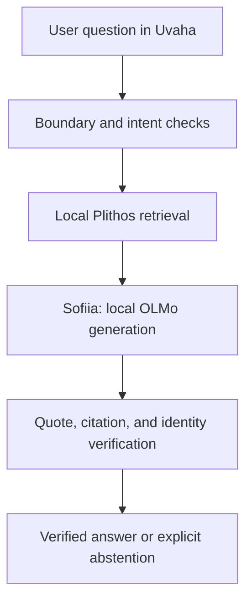

# Orthodox Intelligence

Orthodox Intelligence (OI) is the research and engineering program behind the
Orthodox configuration of **Uvaha**, a local-first AI application. The first
integrated model configuration is **Sofiia v0.1**: OLMo 2 7B Instruct provides
the language/reasoning substrate and the versioned Plithos corpus supplies
retrieved Orthodox evidence with resolvable provenance.

The repository now includes the verified English Plithos evidence package
integration, reusable Plithos search, deterministic Old/New Calendar support,
a loopback-only OLMo runtime adapter, and a first evidence-packed generation
path. Model weights are not bundled. Sofiia-generated answers are shown only
after cited segment IDs resolve to the retrieved evidence and registered direct
quotations match that evidence exactly. The repository does **not** yet contain
a production Ethical Learning Framework (ELF), a frozen quantized model artifact,
or an application ready for pastoral or public release.

## Names and boundaries

- **Uvaha** is the application/product name.
- **Sofiia v0.1** is the first integrated model configuration.
- **OLMo 2 7B Instruct** is Sofiia v0.1's selected language/reasoning substrate.
- **Plithos** is the versioned evidence and retrieval system; in v0.1 its content
  is retrieved at inference rather than baked into the model weights.
- **Orthodox Intelligence** remains the research/program lineage and Orthodox
  system architecture.

These names do not collapse the technical layers. Substrate weights, Plithos
corpus, future ELF text, retrieval settings, verifier, and application version
remain independently versioned and testable.

## The design in one sentence

OI separates four things that must not be allowed to blur together:

1. a trained behavioral substrate;
2. a short, explicit, versioned Orthodox ELF;
3. an on-device Plithos evidence store; and
4. deterministic verification and product boundaries.



Sofiia is not presented as a Christian, a member of the Church, clergy, a
spiritual father, or a substitute for sacramental and pastoral life. It is an
artificial system whose Orthodox factual support is tied to identifiable Plithos
evidence.

## Repository map

- `docs/OI_RESEARCH_AND_TRAINING_SPECIFICATION_v0.1.md` - controlling v0.1
  research specification.
- `docs/ARCHITECTURE.md` - component boundaries and offline inference path.
- `docs/EVALUATION_PROTOCOL.md` - factorial experiment and release evaluation.
- `docs/DATA_AND_PROVENANCE.md` - corpus, rights, lineage, and contamination rules.
- `docs/ELF_REVIEW_PROTOCOL.md` - process for producing a production ELF.
- `docs/THREAT_MODEL.md` - anticipated failures and mitigations.
- `docs/ROADMAP.md` - staged work and exit criteria.
- `docs/DECISION_LOG.md` - decisions already made and their scope.
- `docs/OPEN_QUESTIONS.md` - matters intentionally not guessed in v0.1.
- `docs/MODEL_CARD_TEMPLATE.md` - evidence required for any model candidate.
- `config/model_olmo2_7b_instruct.v1.json` - selected OLMo 2 substrate manifest.
- `config/model_sofiia.v0.1.json` - integrated Sofiia v0.1 model manifest.
- `config/plithos_corpus.v1.json` - pinned Plithos evidence manifest.
- `schemas/` - machine-readable records for corpus, training, evaluation, and
  release manifests.
- `config/acceptance_criteria.v0.1.json` - provisional measurable gates.
- `tools/check_repository.py` and `tests/` - dependency-free repository checks.
- `prototype/` and `oi_prototype/` - Uvaha browser prototype and local retrieval,
  calendar, policy, verifier, HTTP, and model-runtime components.
- `evaluation/` - development behavioral suite and runtime-neutral forced-choice
  scoring contract.

## Run Uvaha in evidence-only mode

Python 3.10 or later is sufficient. No packages need to be installed for the
retrieval-only path.

```bash
python tools/serve_prototype.py
```

Then open `http://127.0.0.1:8765`.

## Run Sofiia v0.1 with a local model process

The development adapter accepts only an explicitly configured loopback
OpenAI-compatible llama.cpp origin. It has no remote fallback.

```bash
python tools/serve_prototype.py --model-endpoint http://127.0.0.1:8080
```

The selected OLMo weights must already be running in that local process. This
repository does not download or bundle them. The next model-artifact step is to
freeze the exact upstream revision, conversion/quantization, tokenizer, and
local weight hash before measured experimentation.

## Selected model substrate

The project owner selected `allenai/OLMo-2-1124-7B-Instruct` as the reference
stock substrate. `oi_prototype/model_runtime.py` provides the development-only
loopback adapter; `oi_prototype/grounded_generation.py` packs retrieved Plithos
evidence into a strict generation contract and performs deterministic citation
and quotation checks. One bounded correction is permitted after verification
failure; a second failure becomes an abstention.

This is not yet a semantic entailment verifier. The current deterministic gate
proves citation membership and exact quotation provenance; broader unsupported-
claim detection remains a separate evaluation and engineering problem.

## Validate the scaffold

```bash
python tools/check_repository.py
python tools/run_evaluation.py --fail-on-any
python -m unittest discover -s tests -v
```

## Current status

Uvaha now has a real optional generative seam: when a local OLMo runtime is
connected, Sofiia v0.1 retrieves Plithos evidence, generates locally, and exposes
the result only after citation/quotation verification. Without the runtime, the
same UI remains a deterministic evidence navigator. Production ELF work,
quantized mobile-runtime selection, semantic claim verification, and target-
device performance testing remain future increments.
